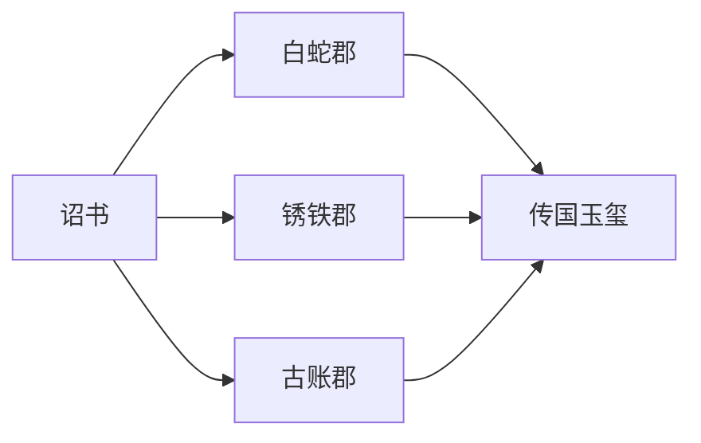

# Runner 食谱 / Runner Cookbook

> 凡郡县奉诏，皆有所循。  
> 本谱依 Runner 类型分章，每章给出最小可运行示例。

> 所有示例均假设处于仓库根目录，且语言郡县位于 `provinces/<id>/`。

---

## 0. 通用约定

每个示例展示三个文件：

```
provinces/<id>/manifest.json
provinces/<id>/main.<ext>
provinces/<id>/README.md       (略)
```

输出统一以 schema-合规 JSON 为目标。stdin 中的诏书最小集如下：

```json
{
  "mission_id": "demo-0001",
  "mode": "parade",
  "edict": "Hello Empire",
  "payload": {},
  "step": 0,
  "stamps": []
}
```

---

## 1. Direct Runner

适合：解释型语言，本机解释器直接运行。

### 1.1 Python（白蛇郡）

`provinces/python/manifest.json`

```json
{
  "id": "python",
  "name": "Python",
  "province": "白蛇郡",
  "category": "interpreted-language",
  "runner": "direct",
  "source": "main.py",
  "build": null,
  "run": "python3 main.py",
  "input": "stdin-json",
  "output": "stdout-json",
  "timeout_ms": 3000,
  "status": "runnable"
}
```

`provinces/python/main.py`

```python
import sys, json

def main():
    data = json.loads(sys.stdin.read())
    stamps = data.get("stamps", [])
    stamps.append({
        "language": "Python",
        "province": "白蛇郡",
        "text": "白蛇郡奉诏",
    })
    out = {
        "language": "Python",
        "province": "白蛇郡",
        "ok": True,
        "message": "Python 郡已奉诏",
        "step": data.get("step", 0) + 1,
        "stamps": stamps,
        "payload": data.get("payload", {}),
    }
    print(json.dumps(out, ensure_ascii=False))

if __name__ == "__main__":
    main()
```

### 1.2 Ruby（红玉郡）

`run`: `ruby main.rb`

```ruby
require "json"
data = JSON.parse(STDIN.read)
data["stamps"] ||= []
data["stamps"] << {"language" => "Ruby", "province" => "红玉郡", "text" => "红玉郡奉诏"}
puts JSON.generate({
  "language" => "Ruby",
  "province" => "红玉郡",
  "ok" => true,
  "message" => "Ruby 郡已奉诏",
  "step" => (data["step"] || 0) + 1,
  "stamps" => data["stamps"],
  "payload" => data["payload"] || {}
})
```

### 1.3 Bash（巴什郡）

`run`: `bash main.sh`

```bash
#!/usr/bin/env bash
INPUT="$(cat)"
STEP=$(echo "$INPUT" | jq '.step // 0')
PAYLOAD=$(echo "$INPUT" | jq '.payload // {}')
STAMPS=$(echo "$INPUT" | jq '.stamps // []')
STAMPS=$(echo "$STAMPS" | jq '. + [{"language":"Bash","province":"巴什郡","text":"巴什郡奉诏"}]')

jq -nc \
  --argjson step "$((STEP+1))" \
  --argjson stamps "$STAMPS" \
  --argjson payload "$PAYLOAD" \
  '{language:"Bash",province:"巴什郡",ok:true,message:"Bash 郡已奉诏",step:$step,stamps:$stamps,payload:$payload}'
```

> Shell 类语言强烈建议依赖 `jq`，避免手写 JSON 拼接。

---

## 2. Compiled Runner

### 2.1 Rust（锈铁郡）

`manifest.json`

```json
{
  "id": "rust",
  "name": "Rust",
  "province": "锈铁郡",
  "category": "compiled-system-language",
  "runner": "compiled",
  "source": "main.rs",
  "build": "rustc main.rs -O -o main",
  "run": "./main",
  "input": "stdin-json",
  "output": "stdout-json",
  "timeout_ms": 5000,
  "status": "runnable"
}
```

`main.rs`（无 serde 依赖时，可用 std + 简易拼接；推荐使用 `cargo` 子项目）

```rust
use std::io::{self, Read};

fn main() {
    let mut buf = String::new();
    io::stdin().read_to_string(&mut buf).unwrap();
    // 演示：不解析诏书，直接输出固定 JSON
    let out = r#"{"language":"Rust","province":"锈铁郡","ok":true,"message":"Rust 郡已奉诏","step":1,"stamps":[{"language":"Rust","province":"锈铁郡","text":"锈铁郡奉诏"}],"payload":{}}"#;
    println!("{}", out);
    let _ = buf;
}
```

> 生产实现请使用 `serde_json`。仓库可使用 `Cargo.toml` 子项目，build 命令改为 `cargo build --release`。

### 2.2 Go（高速郡）

`manifest.json` 中 `build`: `go build -o main .`，`run`: `./main`。

```go
package main
import (
  "encoding/json"
  "io"
  "os"
)
func main() {
  body, _ := io.ReadAll(os.Stdin)
  var in map[string]any
  json.Unmarshal(body, &in)
  step, _ := in["step"].(float64)
  stamps, _ := in["stamps"].([]any)
  stamps = append(stamps, map[string]any{
    "language": "Go", "province": "高速郡", "text": "高速郡奉诏",
  })
  out := map[string]any{
    "language": "Go", "province": "高速郡", "ok": true,
    "message": "Go 郡已奉诏",
    "step": int(step) + 1,
    "stamps": stamps, "payload": in["payload"],
  }
  json.NewEncoder(os.Stdout).Encode(out)
}
```

---

## 3. VM Runner

### 3.1 Java（虚机郡）

```json
{
  "runner": "vm",
  "build": "javac Main.java",
  "run": "java -cp . Main"
}
```

`Main.java` 使用 Jackson 或自带 `java.net.http`/`java.util.HashMap` + 自实现 JSON。  
推荐：项目内置一份极小 JSON 工具类（约 200 行），避免引入 Maven。

### 3.2 C#（锐音郡）

```json
{
  "runner": "vm",
  "build": "dotnet build -c Release -o bin",
  "run": "dotnet bin/main.dll"
}
```

### 3.3 Erlang（鸽信郡）

```json
{
  "runner": "vm",
  "build": "erlc main.erl",
  "run": "erl -noshell -s main main -s init stop"
}
```

---

## 4. Docker Runner

适用于：环境复杂、不便宿主机直装。

### 4.1 COBOL（古账郡）

`manifest.json`

```json
{
  "id": "cobol",
  "name": "COBOL",
  "province": "古账郡",
  "category": "historical-language",
  "runner": "docker",
  "image": "qinlang/cobol:1.0",
  "source": "main.cob",
  "build": "cobc -x main.cob -o main",
  "run": "./main",
  "input": "stdin-json",
  "output": "stdout-json",
  "timeout_ms": 10000,
  "status": "runnable"
}
```

`main.cob`（节选，输出固定 JSON 字符串即可）

```cobol
       IDENTIFICATION DIVISION.
       PROGRAM-ID. EDICT.
       PROCEDURE DIVISION.
           DISPLAY '{"language":"COBOL","province":"古账郡","ok":true,"message":"COBOL 郡已奉诏","step":1,"stamps":[{"language":"COBOL","province":"古账郡","text":"古账郡奉诏"}],"payload":{}}'.
           STOP RUN.
```

调度器执行流：

```
docker run --rm -i \
  --network=none \
  --read-only \
  -v $(pwd)/provinces/cobol:/work \
  -w /work \
  qinlang/cobol:1.0 \
  /usr/local/bin/qinlang-province
```

`qinlang-province` 包装器负责：构建（如需）→ 执行 run → 透传 stdin/stdout。

---

## 5. Query Runner

### 5.1 SQL（簿录郡）

```json
{
  "id": "sql",
  "name": "SQL",
  "province": "簿录郡",
  "category": "query-language",
  "runner": "query",
  "source": "main.sql",
  "run": "sqlite3 :memory: < main.sql",
  "input": "ignored",
  "output": "wrapped-json",
  "timeout_ms": 3000,
  "status": "runnable"
}
```

`main.sql`

```sql
SELECT '{"language":"SQL","province":"簿录郡","ok":true,"message":"SQL 郡已奉诏","step":1,"stamps":[{"language":"SQL","province":"簿录郡","text":"簿录郡奉诏"}],"payload":{}}';
```

### 5.2 jq（角铲郡）

```json
{
  "runner": "query",
  "source": "main.jq",
  "run": "jq -c -f main.jq",
  "input": "stdin-json",
  "output": "stdout-json"
}
```

`main.jq`

```jq
{
  language: "jq",
  province: "角铲郡",
  ok: true,
  message: "jq 郡已奉诏",
  step: ((.step // 0) + 1),
  stamps: ((.stamps // []) + [{language:"jq",province:"角铲郡",text:"角铲郡奉诏"}]),
  payload: (.payload // {})
}
```

### 5.3 GraphQL（图查郡）

GraphQL 自身不可执行；本项目通过自带的 `tools/runners/graphql_runner.py` 把 schema + query 渲染成 JSON。

```json
{
  "runner": "query",
  "source": "main.graphql",
  "run": "python3 ../../tools/runners/graphql_runner.py main.graphql",
  "input": "ignored",
  "output": "wrapped-json"
}
```

---

## 6. Render Runner

适用于：HTML/CSS/Mermaid/PlantUML/Graphviz 等只能渲染产物的语言。

### 6.1 Mermaid（美人鱼郡）

```json
{
  "runner": "render",
  "source": "main.mmd",
  "run": "mmdc -i main.mmd -o main.svg",
  "input": "ignored",
  "output": "rendered-file",
  "timeout_ms": 8000,
  "status": "render-only"
}
```

`main.mmd`



调度器对 `output: rendered-file` 类语言的处理：

1. 检查产物文件存在；
2. 检查产物为合法 SVG / PNG；
3. 自动包装为：

```json
{
  "language": "Mermaid",
  "province": "美人鱼郡",
  "ok": true,
  "message": "Mermaid 郡已渲染",
  "step": 1,
  "stamps": [{"language":"Mermaid","province":"美人鱼郡","text":"美人鱼郡奉诏"}],
  "payload": {"artifact": "main.svg", "bytes": 4321}
}
```

### 6.2 Graphviz DOT（点连郡）

```json
{
  "runner": "render",
  "source": "main.dot",
  "run": "dot -Tsvg main.dot -o main.svg",
  "output": "rendered-file"
}
```

---

## 7. Proof Runner

### 7.1 Lean 4（精证郡）

```json
{
  "id": "lean4",
  "runner": "proof",
  "source": "Main.lean",
  "build": "lean Main.lean",
  "run": null,
  "input": "ignored",
  "output": "wrapped-json",
  "timeout_ms": 60000,
  "status": "verify-only"
}
```

`Main.lean`

```lean
theorem qin_law_unifies (n : Nat) : n + 0 = n := by
  induction n <;> simp_all
```

调度器策略：

- `proof` runner 不要求语言运行；
- 只要求 `build`（即检查器）退出码为 0；
- 自动包装出 `ok: true / false`、`message` 含编译器最后 N 行。

### 7.2 TLA+（时序郡）

```json
{
  "runner": "proof",
  "source": "Main.tla",
  "build": "tlc Main.tla -workers auto -deadlock",
  "run": null,
  "output": "wrapped-json"
}
```

---

## 8. Shader Runner

### 8.1 GLSL（着色郡）

```json
{
  "runner": "shader",
  "source": "main.frag",
  "build": "glslangValidator -V main.frag -o main.spv",
  "run": null,
  "output": "wrapped-json"
}
```

只验证编译。`payload.artifact` 报告 SPIR-V 字节数。

### 8.2 WGSL（网着郡）

```json
{
  "runner": "shader",
  "source": "main.wgsl",
  "build": "naga main.wgsl --validate full",
  "run": null,
  "output": "wrapped-json"
}
```

---

## 9. HDL Runner

### 9.1 Verilog（电路郡）

```json
{
  "runner": "hdl",
  "source": "main.v",
  "build": "iverilog -o main main.v",
  "run": "vvp main",
  "input": "ignored",
  "output": "wrapped-json"
}
```

`main.v`

```verilog
module main;
  initial begin
    $display("{\"language\":\"Verilog\",\"province\":\"电路郡\",\"ok\":true,\"message\":\"电路郡奉诏\",\"step\":1,\"stamps\":[{\"language\":\"Verilog\",\"province\":\"电路郡\",\"text\":\"电路郡奉诏\"}],\"payload\":{}}");
    $finish;
  end
endmodule
```

---

## 10. Esolang Runner

### 10.1 Brainfuck（奇技郡）

`provinces/brainfuck/manifest.json`

```json
{
  "id": "brainfuck",
  "name": "Brainfuck",
  "province": "奇技郡",
  "category": "esolang",
  "runner": "esolang",
  "interpreter": "../../tools/esolang/brainfuck.py",
  "source": "main.bf",
  "run": "python3 ../../tools/esolang/brainfuck.py main.bf",
  "input": "ignored",
  "output": "wrapped-json",
  "timeout_ms": 5000,
  "status": "runnable"
}
```

`main.bf`（输出固定文本 `BF`）

```brainfuck
++++++++[>++++++++<-]>++.+++++.
```

`tools/esolang/brainfuck.py`（解释器，节选）

```python
import sys
def run_bf(src):
    tape = bytearray(30000); ptr = 0
    out = []
    stack = []
    pc = 0
    while pc < len(src):
        c = src[pc]
        if   c == '>': ptr += 1
        elif c == '<': ptr -= 1
        elif c == '+': tape[ptr] = (tape[ptr]+1) & 0xff
        elif c == '-': tape[ptr] = (tape[ptr]-1) & 0xff
        elif c == '.': out.append(chr(tape[ptr]))
        elif c == '[':
            if tape[ptr] == 0:
                depth = 1
                while depth:
                    pc += 1
                    if src[pc] == '[': depth += 1
                    elif src[pc] == ']': depth -= 1
            else:
                stack.append(pc)
        elif c == ']':
            if tape[ptr] != 0: pc = stack[-1]
            else: stack.pop()
        pc += 1
    return ''.join(out)

if __name__ == "__main__":
    src = open(sys.argv[1]).read()
    text = run_bf(src)
    import json
    print(json.dumps({
        "language":"Brainfuck","province":"奇技郡","ok":True,
        "message":"奇技郡奉诏，输出："+text,
        "step":1,
        "stamps":[{"language":"Brainfuck","province":"奇技郡","text":"奇技郡奉诏"}],
        "payload":{"raw_output":text}
    }, ensure_ascii=False))
```

> 调度器对 `output: wrapped-json` 的语言只做 schema 校验，不再要求 stdout 是源语言写的 JSON。

### 10.2 Whitespace、LOLCODE、Befunge 同理：源码负责输出原始数据，包装器负责生成合规 JSON。

---

## 11. Manual Runner

适用于：ABAP、Apex、LabVIEW、MATLAB 等专有平台。

```json
{
  "runner": "manual",
  "source": "main.abap",
  "run": null,
  "status": "manual",
  "platform": {"linux": false, "macos": false, "windows": false}
}
```

调度器遇到 `manual` 一律记 `skipped`，并要求维护者人工提交一份合规 JSON 至：

```
provinces/<id>/expected.json
```

御史台抽查时仅校验 `expected.json` 是否合规。

---

## 12. 模板速查

| 你的语言 | 推荐章节 |
|---|---|
| 有官方解释器、本机就能跑 | §1 Direct |
| 需要先编译再运行 | §2 Compiled |
| 跑在 JVM/.NET/BEAM | §3 VM |
| 工具链复杂或冷门 | §4 Docker |
| SQL / jq / GraphQL / XPath | §5 Query |
| 输出图 / 文档 | §6 Render |
| Lean / Coq / TLA+ / Dafny | §7 Proof |
| GLSL / WGSL / SPIR-V | §8 Shader |
| Verilog / VHDL | §9 HDL |
| Brainfuck / 整活 | §10 Esolang |
| 商业平台 / 专有 | §11 Manual |
